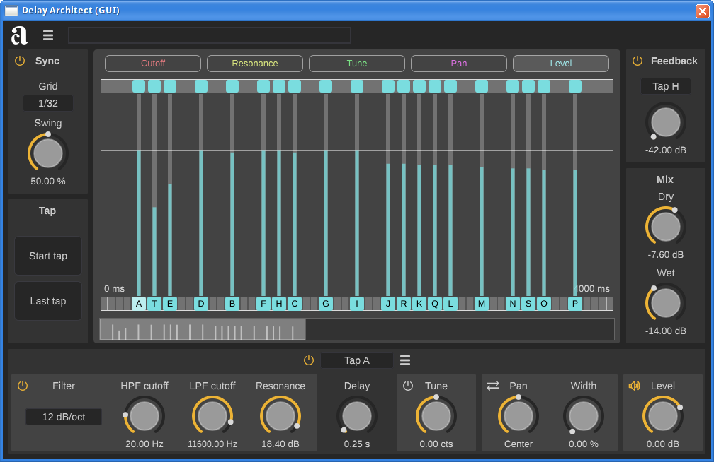

# DelayArchitect

A visual, musical editor for delay effects



## Download development builds

- [32-bit Windows VST3](https://nightly.link/jpcima/DelayArchitect/workflows/build/master/Win32%20VST3.zip)
- [64-bit Windows VST3](https://nightly.link/jpcima/DelayArchitect/workflows/build/master/Win64%20VST3.zip)
- [64-bit GNU/Linux VST3](https://nightly.link/jpcima/DelayArchitect/workflows/build/master/GNU-Linux%20VST3.zip)
- [macOS Universal AU (**self-signed**)](https://nightly.link/jpcima/DelayArchitect/workflows/build/master/macOS%20AU.zip)
- [macOS Universal VST3 (**self-signed**)](https://nightly.link/jpcima/DelayArchitect/workflows/build/master/macOS%20VST3.zip)

## How to build

Install the prerequisites.

``` sh
sudo apt install build-essential libgl-dev libx11-dev libxext-dev libxrandr-dev libxinerama-dev libxcursor-dev libasound2-dev
```

Check out the source code and build.

``` sh
git clone --recursive https://github.com/jpcima/DelayArchitect.git
mkdir DelayArchitect/build
cd DelayArchitect/build
cmake -DCMAKE_BUILD_TYPE=Release ..
cmake --build .
```
